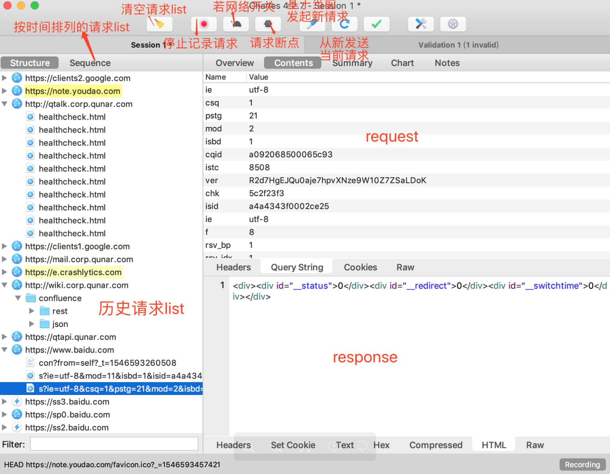
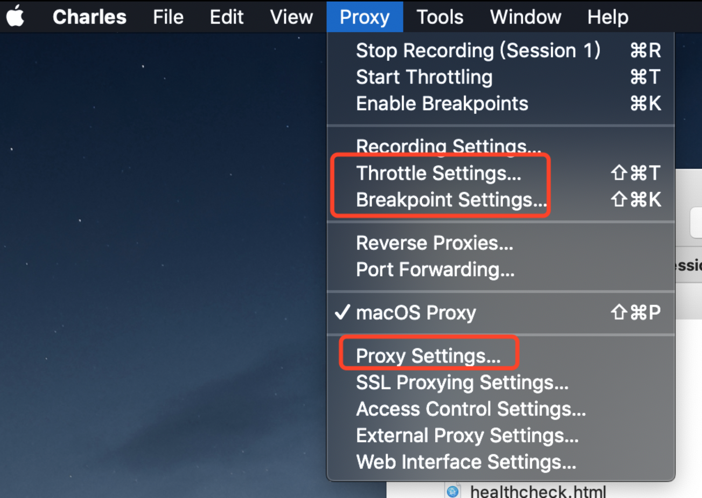

## 一、安装工作
Charles 下载地址：https://www.charlesproxy.com/

Charles 在线破解工具：https://www.zzzmode.com/mytools/charles/

### 破解方法：

安装完 Charles 后，打开运行
根据安装版本号，在线生成对应的jar文件
application => Charles => 右键 显示包内容 => Contents => Java => charles.jar
根据2步骤找到jar文件后，用在线生成的jar文件将其替换
关闭 Charles 再次打开运行即可
Charles的证书安装及使用技巧参考阳哥的 移动端调试方法和技巧总结 

## 二、如何使用
### 1、大致布局

ps：若网络 改为 弱网络

tips:
如果请求路径有多级，则以文件夹的形式展开（如上图 【历史请求list】字体右侧）

### 2、其他设置
如下，对于弱网络、断点、代理等设置都在此处进行更改；

tips：注意 HTTPS协议默认端口值：443

## 三、问题

### 1、手机安装及信任证书问题
在过程中，浏览器并没有弹出窗口安装证书

以上问题解决方法： [Charles不出现安装证书弹窗问题](https://blog.csdn.net/baby_come_here/article/details/60878066)

### 2、红叉号 unknown 问题
可能是证书没有被信任，需要在 设置 => 关于手机 => 证书信任设置 信任即可

